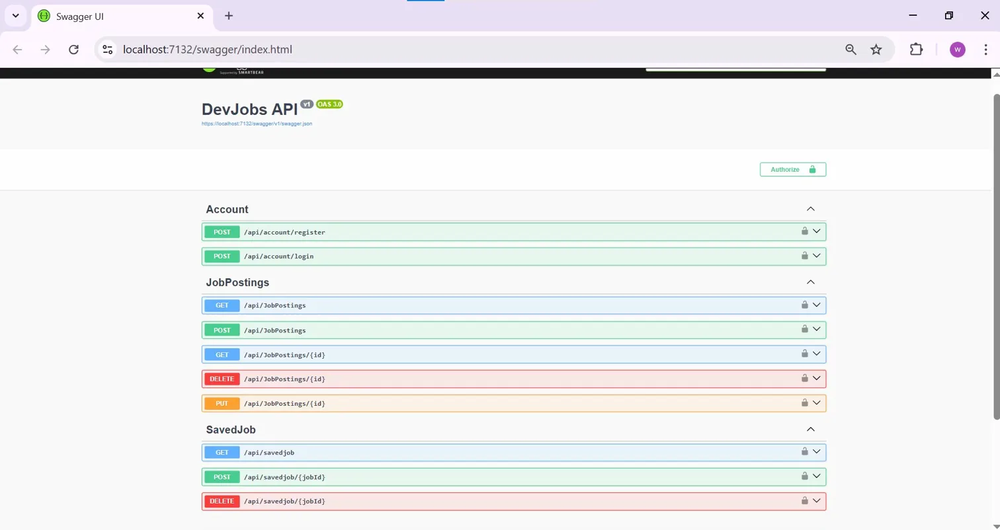

# DevJobsAPI

A production-ready RESTful Job Board API built with ASP.NET Core 10 and 
Entity Framework Core, deployed on Microsoft Azure.

Users can register, post jobs, and save favorites — with full ownership-based 
authorization so you can only edit or delete your own posts.

## 🌐 Live Demo
[View Live API on Azure](https://devjobsapi20260330184811-cte9aphkayf9amfj.uaenorth-01.azurewebsites.net/swagger)

## Tech Stack
- ASP.NET Core 10 / C#
- Entity Framework Core + SQL Server
- ASP.NET Core Identity + JWT Authentication
- Repository Pattern + DTOs
- Swagger UI (OpenAPI 3.0)
- Microsoft Azure (App Service + Azure SQL)

## Key Features
- JWT auth with role-based access (Admin / User)
- Ownership protection — returns 403 if you try to edit someone else's job
- Save/unsave jobs (many-to-many relationship)
- Search & filter by title, company, location, and minimum salary
- Server-side pagination
- Global exception handling middleware
- Full CRUD for job postings

## Endpoints
| Method | Route | Auth | Description |
|--------|-------|------|-------------|
| POST | /api/account/register | ❌ | Register new user |
| POST | /api/account/login | ❌ | Login + get JWT |
| GET | /api/jobpostings | ❌ | Get all jobs (filter/search) |
| GET | /api/jobpostings/{id} | ❌ | Get job by ID |
| POST | /api/jobpostings | ✅ | Create a job |
| PUT | /api/jobpostings/{id} | ✅ Owner | Update your job |
| DELETE | /api/jobpostings/{id} | ✅ Owner | Delete your job |
| GET | /api/savedjob | ✅ | Get your saved jobs |
| POST | /api/savedjob/{jobId} | ✅ | Save a job |
| DELETE | /api/savedjob/{jobId} | ✅ | Unsave a job |

## Getting Started
1. Clone the repo
2. Set your connection string in `appsettings.json`
3. Run `dotnet ef database update`
4. Hit `F5` and open Swagger UI at `https://localhost:{port}/swagger`
